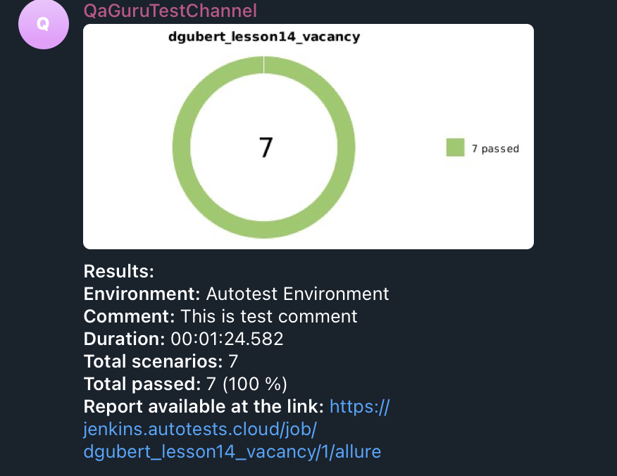

<h1 align="center">14 урок. Домашняя работа.<br>Тесты на страницу Вакансии компании <a href="https://ozerki.ru/vacancies/"> Озерки.</a></h1>


##  **Содержание:**

---

* [Технологии и инструменты](#технологии-и-инструменты)
* [Проверки](#-проверки)
* [Запуск тестов в Jenkins](#-запуск-тестов-в-jenkins)
* [Allure Report](#--allure-report)
* [Уведомление в Telegram о результатах тестов](#-уведомление-в-telegram-о-результатах-тестов)

## Технологии и инструменты:

---


| Java                                                                                         | IntelliJ  <br>  Idea                                                                                                 | GitHub                                                                                                           | JUnit 5                                                                                                           | Gradle                                                                                                     | Selenide                                                                                                         | Selenoid                                                                                                                  | Allure <br> Report                                                                                                         | Jenkins                                                                                                          | Telegram                                                                                                            |
|:---------------------------------------------------------------------------------------------|----------------------------------------------------------------------------------------------------------------------|------------------------------------------------------------------------------------------------------------------|-------------------------------------------------------------------------------------------------------------------|------------------------------------------------------------------------------------------------------------|------------------------------------------------------------------------------------------------------------------|---------------------------------------------------------------------------------------------------------------------------|----------------------------------------------------------------------------------------------------------------------------|------------------------------------------------------------------------------------------------------------------|---------------------------------------------------------------------------------------------------------------------|
| <a href="https://www.java.com/"> </a> | <a href="https://www.jetbrains.com/idea/"></a> | <a href="https://github.com/"></a> | <a href="https://junit.org/junit5/"></a> | <a href="https://gradle.org/"></a> | <a href="https://selenide.org/"></a> | <a href="https://aerokube.com/selenoid/"></a> | <a href="https://github.com/allure-framework"></a> | <a href="https://www.jenkins.io/"></a> | <a href="https://web.telegram.org/"></a> |


Содержание [Allure-отчета](https://jenkins.autotests.cloud/job/dgubert_lesson14_vacancy/allure/#suites):
* Шаги теста
* Скриншот страницы на последнем шаге
* Page Source
* Логи браузерной консоли
* Видео выполнения автотеста


##  Проверки:

---

- ✓ *[Проверка названия страницы](https://jenkins.autotests.cloud/job/dgubert_lesson14_vacancy/allure/#suites/0598bc41331f40ac0f38fe5d0c32bb00/1c28556ee444b478/)*
- ✓ *[Проверка наличия вакансий на странице](https://jenkins.autotests.cloud/job/dgubert_lesson14_vacancy/allure/#suites/0598bc41331f40ac0f38fe5d0c32bb00/14a613d3621c9b18/)*
- ✓ *[Проверка поиска вакансий](https://jenkins.autotests.cloud/job/dgubert_lesson14_vacancy/allure/#suites/0598bc41331f40ac0f38fe5d0c32bb00/1e4c6794abd12a0c/)*

##  Запуск тестов в Jenkins:

---

**Сборка в [Jenkins](https://jenkins.autotests.cloud/job/dgubert_lesson14_vacancy/)**
- *browserName - браузер, по умолчанию chrome*
- *browserVersion - версия браузера, по умолчанию 126.0*
- *browserSize - размер окна браузера, по умолчанию 1920x1080*
- *remoteUrl - логин, пароль и адрес удаленного сервера Selenoid*

**Команда для запуска тестов**
```bash  
clean test --debug
-DbrowserName=${browserName}
-DbrowserVersion=${browserVersion}
-DbrowserSize=${browserSize}
-DselenoidUrl=${selenoidUrl}
```

## </a>  <a name="Allure"></a>Allure Report	</a>

---

## Основная страница отчёта

<p align="center">  
  
</p>  

## Тест-кейсы

<p align="center">  

</p>


## </a> Уведомление в Telegram о результатах тестов
____
<p align="center">  
  
</p>